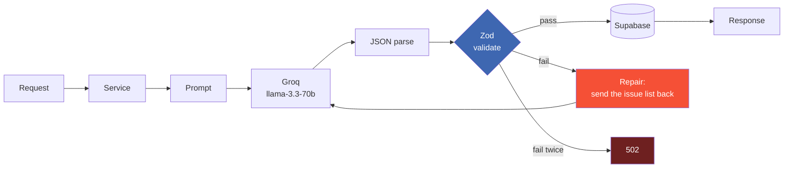

<div align="center">

# iffy.ai

**Ask "what if?" and get a consequence graph instead of a paragraph.**

Pick a hypothetical, and iffy.ai simulates how it ripples outward: which sectors move, what trades off against what, how it unfolds over time, and what people on different sides would argue about it.


<br><br>


</div>

---

## The problem with asking an LLM "what if"

You get prose. Prose is hard to explore, impossible to branch, and easy to nod along to without noticing the model contradicted itself two paragraphs up.

iffy.ai forces the model to answer in a **typed structure** instead: nodes, edges, sectors, timelines, debate turns. That makes the answer navigable, branchable, and checkable. And because it is checkable, the system can tell when the model got it wrong.

---

## The interesting part: the model does not get the last word

Every generation runs through validate-and-repair. If output fails its schema, the failures are handed back to the model as text and it tries again. Only a second failure surfaces an error.



Validation is not just "is this JSON". The schemas enforce floors, so the model cannot pass by answering thinly:

| Rule | Floor |
|---|---|
| Consequence nodes | at least **6** |
| Causal edges between them | at least **5** |
| Sectors affected | at least **4** |
| Debate participants | at least **3** |

Zod issues are flattened to `[path.to.field] message` before going back to the model, so the repair prompt names exactly what was wrong rather than asking it to try harder.

---

## What you can do with a scenario

| Endpoint | What it does |
|---|---|
| `POST /api/simulate` | Turn a hypothetical into a full consequence graph, sector breakdown and timeline |
| `POST /api/mutate` | Branch an existing simulation under a new condition, keeping the original intact |
| `POST /api/debate` | Stage a multi-participant argument about the scenario, and continue it with follow-ups |
| `POST /api/sector` | Drill into one sector for a deeper read than the overview gives |

`community`, `saved` and `marketplace` routes back sharing and revisiting scenarios.

---

## Layout

```
backend/                 Next.js 15 App Router, API only
  app/api/               route handlers
  lib/
    ai/
      groq.ts            client, model and retry budget
      pipeline/          generate -> validate -> repair
      prompts/           one system + user prompt per endpoint
    schemas/             Zod: node, edge, timeline, sector, simulation, debate
    services/            business logic, one per endpoint
    supabase/            client and SQL migration
    utils/               logger, typed errors, cache
frontend/                the UI that shipped: React Flow graph, Recharts, Zustand
frontend_v2/             an alternate shadcn/Radix build explored during the sprint
```

`backend/README.md` has the request and response shapes for each endpoint.

---

## Running it

```bash
cd backend
npm install
cp .env.local.example .env.local     # GROQ_API_KEY + Supabase keys
# run lib/supabase/migrations/001_initial.sql in the Supabase SQL editor
npm run dev                          # http://localhost:3000
```

Model and retry budget are environment-driven, so you can swap either without touching code:

```bash
GROQ_MODEL=llama-3.3-70b-versatile   # default
AI_MAX_RETRIES=2                     # default
```

---

## Provenance

Built for **ProdX @ NAVERA '26**, the Scaler School of Business AI hackathon, and placed **Top 7 out of 350+ teams**.

Built by [Muneer Alam](https://github.com/Muneer320), [Amrit Kang](https://github.com/amritkang165) and Akshaj Garlapati. Mentored by Anshuman Singh.

Archived. It is not maintained, and the repo is kept as a record of what was built during the sprint.
